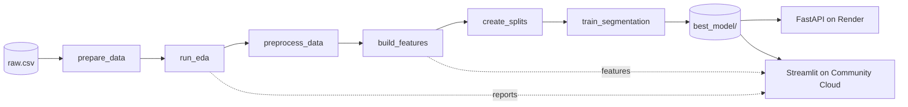

# Customer & Sales Analytics


An end-to-end, reproducible analytics and unsupervised-learning system for an e-commerce transaction dataset. One batch pipeline turns raw transactions into validated datasets, descriptive sales intelligence, customer-level behavioral features, and a promoted customer-segmentation model, which is then served through a **FastAPI** service and explored in a **Streamlit** dashboard.

## Live demo

| Component | URL | Hosted on |
|---|---|---|
| Dashboard | https://e-commerce-customer-segmentation-aml.streamlit.app/ | Streamlit Community Cloud |
| REST API (Swagger docs) | https://e-commerce-customer-segmentation-4o2p.onrender.com/docs | Render (free tier) |
| API health check | https://e-commerce-customer-segmentation-4o2p.onrender.com/api/v1/health | Render |

> The API runs on Render's free tier and sleeps when idle, so the first request after a quiet period can take about a minute. In both deployments the pipeline-retraining feature is **disabled**; it is intended for local use only.

The project deliberately separates two objectives:

| Objective | Nature | What it produces |
|---|---|---|
| **Sales analytics** | Descriptive (no forecasting) | KPIs, monthly and weekday trends, product and category mix, correlations, zero-transaction gap diagnostics |
| **Customer segmentation** | Unsupervised ML (the only ML component) | RFM + behavioral features, a model-comparison study, and a promoted PCA-2 + KMeans-2 model |

---

## Table of contents

- [Highlights](#highlights)
- [Key results](#key-results)
- [Architecture](#architecture)
- [Quick start](#quick-start)
- [Batch pipeline](#batch-pipeline)
- [Feature engineering](#feature-engineering)
- [Segmentation methodology](#segmentation-methodology)
- [REST API](#rest-api)
- [Streamlit dashboard](#streamlit-dashboard)
- [Configuration](#configuration)
- [Generated outputs](#generated-outputs)
- [Deployment](#deployment)
- [Repository layout](#repository-layout)
- [Development](#development)
- [Limitations and scope](#limitations-and-scope)
- [Author](#author)

---

## Highlights

- **Config-driven, deterministic pipeline** with a fixed seed, YAML-defined paths, and a timestamped log per run.
- **Strict data contract**: Pandera schema validation, null-rate, categorical-domain, and range checks, with all issues reported together.
- **Leakage-aware modeling**: outcome and review fields are documented and excluded from modeling inputs.
- **Split strategy chosen per objective**: random row-level splits for independent customers, chronological splits for daily sales.
- **Rigorous model comparison**: KMeans, Gaussian mixtures, agglomerative, HDBSCAN, PCA sweeps, and robust scaling, ranked by a multi-seed stability rule.
- **Safe promotion**: a newly trained model replaces the stored best model only if it improves silhouette (Davies–Bouldin breaks ties).
- **Pure-inference API**: `/predict` never fits anything; it calls `transform` and `predict` on the promoted bundle and hot-reloads when the model file changes.
- **Deployment-aware dashboard**: eight pages, with the pipeline page hidden automatically when `APP_ENABLE_PIPELINE=false`.

## Key results

The generated artifacts correspond to a run on **200,000 transaction records × 50 source columns**.

| Item | Result |
|---|---:|
| Customer feature rows | 69,728 |
| Daily sales feature rows | 365 |
| Selected model | PCA-2 + KMeans-2 |
| Modeling features | 9 numeric (+ 2 categorical used for profiling) |
| Full-data silhouette score | 0.3876 |
| Full-data Davies–Bouldin score | 0.9758 |
| Cluster 0 / Cluster 1 sizes | 35,311 / 34,417 |
| Random seed | 42 |

> Silhouette scores of about 0.2–0.4 are typical for noisy, real-world behavioral data. The model is a stable behavioral segmentation baseline, **not** a claim of perfectly separated populations. Interpret clusters through `cluster_profile.csv`, not through cluster numbers, which are arbitrary labels.

## Architecture



**Design principles**

- `src/customer_sales_analytics/` holds all scientific logic as importable, documented modules.
- `scripts/` contains thin CLI entry points, one per pipeline stage.
- `api/` and `streamlit_app/` are presentation layers. The dashboard reuses the API's model registry and prediction service in-process, so model paths and feature rules live in one place. **The dashboard does not call the hosted API over HTTP**; both apps load the same committed model bundle independently.

## Quick start

**Prerequisites:** Python 3.14+ and [`uv`](https://docs.astral.sh/uv/).

```bash
# 1. Install dependencies
uv sync

# 2. Place the dataset at data/raw/raw.csv (not included in the repository)

# 3. Run the complete pipeline
uv run customer-sales-pipeline

# 4. Start the API (http://127.0.0.1:8000/docs)
uv run uvicorn api.main:app --reload --port 8000

# 5. Start the dashboard (http://localhost:8501)
uv run streamlit run streamlit_app/app.py
```

To use the API or dashboard **without** the raw dataset, clone the repository as-is: the promoted model, cluster profile, feature tables, and reports are committed, so steps 4 and 5 work immediately.

Create a local `.env` file (Git-ignored) for local settings:

```dotenv
APP_API_HOST=127.0.0.1
APP_API_PORT=8000
APP_LOG_LEVEL=INFO
APP_CORS_ALLOW_ORIGINS=["*"]
APP_PIPELINE_TIMEOUT_SECONDS=3600
APP_ENABLE_PIPELINE=true
```

Configuration paths can be overridden for experiments:

```bash
uv run customer-sales-pipeline \
  --data-config configs/data_config.yaml \
  --paths-config configs/paths.yaml \
  --preprocessing-config configs/preprocessing_config.yaml
```

## Batch pipeline

The orchestrator (`src/customer_sales_analytics/pipelines/main_pipeline.py`) runs each stage as a subprocess in dependency order, writes one timestamped log to `logs/`, and **stops at the first failed stage**, returning that stage's exit code.

| # | Stage | Script | Key outputs |
|---|---|---|---|
| 1 | Validate & load | `prepare_data.py` | `data/interim/validated.csv`, `validation_report.json` |
| 2 | Descriptive EDA | `run_eda.py` | `eda_summary.json`, 10 PNG figures |
| 3 | Preprocess | `preprocess_data.py` | `data/interim/preprocessed.csv`, `preprocessing_report.json` |
| 4 | Feature engineering | `build_features.py` | customer and sales feature tables, `feature_engineering_report.json` |
| 5 | Split | `create_splits.py` | train/validation/test partitions, `split_report.json` |
| 6 | Train & promote | `train_segmentation.py` | model bundle, `segmentation_training_report.json`, cluster profile, promoted `best_model/` |

Run any stage on its own when debugging:

```bash
uv run python scripts/prepare_data.py
uv run python scripts/run_eda.py
uv run python scripts/preprocess_data.py
uv run python scripts/build_features.py
uv run python scripts/create_splits.py
uv run python scripts/train_segmentation.py
```

The model-comparison study is a **separate analysis script**, not part of the end-to-end run:

```bash
uv run python scripts/compare_segmentation_models.py
```

### Validation and preprocessing

**Validation** (`src/customer_sales_analytics/data/`):

- Required and unexpected column checks, and a strict Pandera schema (dtypes, nullability, domain checks).
- Duplicate-row detection and per-column null-rate limits (`Return_Reason` and `Coupon_Code` are exempt as legitimately optional).
- Categorical allow-lists and numeric range checks (age, quantity, discount, tax, rating, delivery days).
- All issues are collected and reported together rather than failing on the first problem.

**Preprocessing** (`src/customer_sales_analytics/preprocessing/`):

- Removes exact duplicates and fixes dtypes.
- Flags future order dates without dropping rows (the dataset spans all of 2026, so future dates are expected).
- Fills semantically not-applicable values: `Return_Reason → "Not Returned"`, `Coupon_Code → "No Coupon"`.
- **Retains business outliers**, since high-value orders are plausible real transactions; the decision and IQR counts are recorded in `preprocessing_report.json`.
- Records leakage-prone columns in `preprocessing_config.yaml`:

```text
Return_Status, Return_Reason, Customer_Rating, Review_Sentiment, Order_Profit_USD
```

> `Return_Status` is deliberately reused to derive `return_rate` as a *descriptive* behavioral signal. This is acceptable because segmentation has no future-outcome target; the rationale is stored in `feature_engineering_report.json`.

## Feature engineering

### Customer features (one row per customer)

| Feature | Description |
|---|---|
| `recency_days` | Days between last order and the reference date (default: latest order date) |
| `frequency` | Distinct orders |
| `monetary_value` | Total net sales (USD) |
| `avg_order_value` | `monetary_value / frequency` |
| `order_value_std` | Standard deviation of per-order value (0 for single-order customers) |
| `product_diversity` | Distinct products purchased |
| `purchase_velocity` | Orders per tenure day (tenure clipped to at least 1 day) |
| `return_rate` | Share of line items with status `Returned` |
| `coupon_usage_rate` | Share of line items with a coupon |
| `preferred_category` | Most common category (ties resolved alphabetically) |
| `preferred_payment_method` | Most common payment method (ties resolved alphabetically) |

`Customer_ID` is kept for traceability only and is never a modeling signal.

### Daily sales features (one row per calendar day)

- **Calendar fields**: year, month, day of week, weekend flag, quarter, day index, and sine/cosine encodings for month and weekday.
- **Sales measures**: `total_sales`, `order_count`, `average_order_value`.
- **Gap handling**: the full date range is reindexed so zero-transaction days stay visible. `is_gap_day` marks them and `gap_filled_sales` gives a linearly interpolated series for smoothing. Observed `total_sales` remains authoritative.

## Segmentation methodology

### Preprocessing for the selected model

1. `log1p` + standardization for skewed features (`monetary_value`, `avg_order_value`).
2. Standard scaling for the remaining numeric features.
3. **PCA (2 components)**.
4. KMeans with `k = 2`, seed 42.

> The selected numeric-only pipeline drops categorical columns, so `preferred_category` and `preferred_payment_method` do **not** affect cluster assignment. They remain in the feature schema and cluster profile for interpretation and API compatibility.

### Candidate comparison

`compare_segmentation_models.py` fits preprocessing on the **training split only**, scores on the **validation split**, and never loads the test split.

| Family | Variants |
|---|---|
| KMeans | k = 2–7 on full, numeric-only, PCA (2/3/4 components), and robust-scaled representations |
| Gaussian mixture | 3–7 components, diagonal covariance |
| Agglomerative | Ward linkage with a k-nearest-neighbor connectivity graph (train-fit scoring) |
| HDBSCAN | `min_cluster_size` ∈ {200, 500, 1000}, noise excluded from scoring |

### Selection and promotion

- **Metrics**: silhouette (higher is better) and Davies–Bouldin (lower is better).
- **Stability**: each candidate is re-run across seeds `42–46`; those with silhouette standard deviation above `0.05` are excluded.
- **Selection rule**: highest `silhouette_mean − silhouette_std` among eligible candidates.
- **Promotion**: `train_segmentation.py` fits the selected pipeline on all customer features and promotes it to `models/segmentation/best_model/` only if silhouette improves; Davies–Bouldin breaks ties.
- **Diagnostics** in `artifacts/reports/`: PCA loadings, feature correlations, and cluster-size diagnostics that flag degenerate 1-vs-rest splits.

## REST API

Live Swagger docs: https://e-commerce-customer-segmentation-4o2p.onrender.com/docs

| Method | Path | Purpose | Deployed |
|---|---|---|---|
| `GET` | `/api/v1/health` | Liveness and promoted-model readiness | Yes |
| `POST` | `/api/v1/predict` | Cluster assignment for one or more engineered customers | Yes |
| `POST` | `/api/v1/pipeline/run` | Run every batch stage and return training metrics | **No** (local only) |

### Predict a customer segment

```bash
curl -X POST https://e-commerce-customer-segmentation-4o2p.onrender.com/api/v1/predict \
  -H "Content-Type: application/json" \
  -d '{
    "customers": [{
      "customer_id": "CUST-EXAMPLE",
      "recency_days": 60.82,
      "frequency": 3.86,
      "monetary_value": 2537.29,
      "avg_order_value": 746.61,
      "order_value_std": 817.27,
      "product_diversity": 3.86,
      "purchase_velocity": 0.0169,
      "return_rate": 0.0414,
      "coupon_usage_rate": 0.1489,
      "preferred_category": "Electronics",
      "preferred_payment_method": "Credit Card"
    }]
  }'
```

```json
{
  "predictions": [
    {
      "customer_id": "CUST-EXAMPLE",
      "cluster": 0,
      "cluster_size": 35311,
      "cluster_profile": { "cluster": 0.0, "cluster_size": 35311.0, "recency_days": 60.82, "...": "..." }
    }
  ],
  "model_trained_at_utc": "2026-09-27T13:15:14.924713+00:00"
}
```

`cluster_profile` is the full matching row from `cluster_profile.csv`. Inputs are validated by Pydantic: numerics must be non-negative, and `return_rate` and `coupon_usage_rate` must be in `[0, 1]`.

### Retrain locally via the API

With `APP_ENABLE_PIPELINE=true`:

```bash
curl -X POST http://127.0.0.1:8000/api/v1/pipeline/run -H "Content-Type: application/json" -d '{}'
```

The response reports `status`, `failed_stage`, `duration_seconds`, `log_path`, and `segmentation_metrics` (model name, silhouette, Davies–Bouldin, cluster sizes, promotion flag, training rows, artifact paths). Optional overrides: `data_config_path`, `paths_config_path`, `preprocessing_config_path`.

### Behavior worth knowing

- **Graceful startup**: with no promoted model, the API still starts; `/health` returns `degraded` and `/predict` returns `503` with `MODEL_NOT_AVAILABLE`.
- **Hot reload**: the registry compares the model file's modification time and reloads automatically, including after a successful pipeline run.
- **Failure semantics**: a failed batch stage returns HTTP `200` with `status: "failed"`; timeouts and configuration errors return HTTP error codes.
- **Feature-flagged retraining**: when `APP_ENABLE_PIPELINE=false`, the `/pipeline/run` route is not mounted at all.

## Streamlit dashboard

Live app: https://e-commerce-customer-segmentation-aml.streamlit.app/

| Page | Contents |
|---|---|
| **Overview** | Executive KPIs, monthly revenue trajectory, cluster distribution, production-model summary |
| **EDA** | Data-quality tables, outlier counts, interactive distributions, correlation heatmaps, zero-transaction days |
| **Sales Analytics** | Date-range filter, revenue/orders/AOV, monthly and weekday performance, top products by category |
| **Customer Segmentation** | Cluster sizes, profile comparison, 2D behavioral map, single-customer explorer |
| **Model Performance** | Silhouette / Davies–Bouldin, seed stability, candidate comparison, selection rationale |
| **Predict Customer** | Form-based live inference using the promoted model |
| **Pipeline** | Manual "Run Full Pipeline" control (**local only**, hidden when `APP_ENABLE_PIPELINE=false`) |
| **About** | Scope, capabilities, and non-goals |

Pages degrade gracefully with informative messages when an artifact or the model is missing.

> **Deployed-mode note:** `data/raw/raw.csv` (about 80 MB) is not in the repository. In the hosted dashboard, the EDA *Distributions* tab and the Sales *product/category* table therefore show "unavailable"; everything else works from the committed feature tables and reports. Run the app locally with the raw file in place to enable them.

## Configuration

| File | Responsibility |
|---|---|
| `configs/paths.yaml` | Input, output, artifact, model, and split locations |
| `configs/data_config.yaml` | Seed, validation rules, EDA settings, split fractions, model-comparison grid |
| `configs/preprocessing_config.yaml` | Null-rate threshold, not-applicable fills, modeling exclusions |
| `pyproject.toml` | Package metadata, dependencies, and CLI entry points |
| `render.yaml` | Render blueprint for the API (and an optional Render-hosted dashboard) |

Default splits are **70 / 15 / 15** with seed `42`. Customer splits are randomly shuffled; sales splits are chronological to prevent future information leaking into earlier partitions.

### Environment variables

All API settings use the `APP_` prefix. The dashboard also honors `APP_ENABLE_PIPELINE`.

| Variable | Default | Description |
|---|---|---|
| `APP_API_HOST` | `127.0.0.1` | API bind host |
| `APP_API_PORT` | `8000` | API bind port |
| `APP_LOG_LEVEL` | `INFO` | Log level |
| `APP_CORS_ALLOW_ORIGINS` | `["*"]` | Allowed CORS origins (JSON list) |
| `APP_PIPELINE_TIMEOUT_SECONDS` | `3600` | Timeout for `/pipeline/run` |
| `APP_ENABLE_PIPELINE` | `true` | Enables the retraining endpoint and the dashboard Pipeline page |

## Generated outputs

| Location | Contents | In Git |
|---|---|---|
| `data/raw/` | Source dataset | No |
| `data/interim/`, `data/splits/` | Validated/preprocessed tables and splits | No |
| `data/processed/` | Customer and sales feature tables | **Yes** (dashboard input) |
| `artifacts/reports/` | JSON reports, cluster profile, diagnostics | **Yes** (API/dashboard input) |
| `artifacts/eda/`, `artifacts/model_comparison/` | PNG charts, comparison tables | No |
| `models/segmentation/candidates/` | Candidate bundle | No |
| `models/segmentation/best_model/` | Promoted model bundle | **Yes** (inference input) |
| `logs/` | Timestamped pipeline logs | No |

```text
models/segmentation/best_model/
├── best_model.joblib     # fitted preprocessing + estimator + metadata
├── best_metrics.json     # metrics, hyperparameters, feature names, cluster sizes, trained_at_utc
└── cluster_profile.csv   # original-feature summaries per cluster
```

## Deployment

The project deploys as two independent services that share one committed model bundle.

### API on Render

Defined in `render.yaml`: builds with `uv sync --frozen`, runs Uvicorn on `$PORT`, health check at `/api/v1/health`, Python 3.14. Environment:

| Variable | Value |
|---|---|
| `APP_ENABLE_PIPELINE` | `false` |
| `APP_CORS_ALLOW_ORIGINS` | `["https://e-commerce-customer-segmentation-aml.streamlit.app"]` (only matters for browser clients) |
| `APP_LOG_LEVEL` | `INFO` |
| `APP_PIPELINE_TIMEOUT_SECONDS` | `3600` |

### Dashboard on Streamlit Community Cloud

| Setting | Value |
|---|---|
| Repository | `aryanshah2109/E-commerce-Customer-Segmentation` |
| Branch | `main` |
| Main file path | `streamlit_app/app.py` |
| Python version | `3.14` |
| Secrets (TOML) | `APP_ENABLE_PIPELINE = "false"` and `APP_LOG_LEVEL = "INFO"` |

`render.yaml` also defines an optional Render-hosted dashboard service with the same flag, if you prefer a single provider.

### Deployment checklist

- The promoted model, `cluster_profile.csv`, feature tables, and report JSON files must be committed (see the `.gitignore` allow-list). Otherwise `/health` reports `degraded` and the dashboard shows "Model unavailable".
- Keep `APP_ENABLE_PIPELINE=false` on every hosted environment. The default is `true`, so a missing variable **enables** retraining.
- Retrain locally, then commit the refreshed `best_model/`, feature tables, and reports to redeploy.

## Repository layout

```text
.
├── api/                              # FastAPI inference & retraining service
│   ├── main.py                       #   app factory, lifespan, CORS, routers
│   ├── config.py                     #   BaseSettings + YAML-derived artifact paths
│   ├── routers/                      #   health, prediction, pipeline
│   ├── schema/                       #   Pydantic request/response models
│   └── services/                     #   model registry, prediction, pipeline services
├── configs/                          # YAML configuration
├── scripts/                          # Thin stage-specific CLI entry points
├── src/customer_sales_analytics/
│   ├── config/                       #   YAML loading and logging
│   ├── data/                         #   loading, Pandera schema, validation, splitting
│   ├── eda/                          #   compute-only analysis + visualizations
│   ├── features/                     #   customer (RFM, behavioral) and sales features
│   ├── preprocessing/                #   cleaning, missing values, outlier/leakage docs
│   ├── segmentation/                 #   pipelines, models, comparison, selection, profiling
│   └── pipelines/                    #   end-to-end orchestration
├── streamlit_app/
│   ├── app.py                        #   entry point and navigation
│   ├── config.py                     #   dashboard paths and pipeline feature flag
│   ├── components/                   #   cards, charts, sidebar, page framing
│   ├── services/                     #   cached data/artifact loading, prediction, pipeline
│   ├── views/                        #   the eight dashboard pages
│   └── styles/style.css
├── artifacts/reports/                # committed reports (deployment input)
├── data/processed/                   # committed feature tables (deployment input)
├── models/segmentation/best_model/   # committed promoted model (deployment input)
├── pyproject.toml
├── render.yaml
└── uv.lock
```

## Development

```bash
uv run ruff check .
uv run black --check .
uv run mypy src scripts
```

`pytest` is installed, but the repository does not yet ship a test suite. Running the full pipeline is the strongest integration check: it exercises the data contract, features, splitting, training, and promotion together.

## Limitations and scope

- **Unsupervised only**: no labeled target and no claim of causal business impact.
- **Descriptive sales**: outputs are historical summaries, not forecasts.
- **In-sample production metrics**: the final training stage fits and scores on all customer features. Held-out validation scoring happens in the separate comparison script.
- **Two coarse segments**: richer models were explored but did not clear the stability-based selection rule.
- **Arbitrary labels**: cluster numbers may change if the data or selected model changes.
- **Reduced hosted feature set**: the deployed dashboard omits raw-data views and retraining by design.
- **Synchronous retraining**: `/pipeline/run` blocks until the pipeline finishes; keep it for trusted local use and restrict CORS in any shared environment.

## Author

**Aryan Shah**
[GitHub](https://github.com/aryanshah2109) · [LinkedIn](https://linkedin.com/in/aryan-shah-3674031ba/) · [Portfolio](https://aryanrshah-portfolio.vercel.app) · aryanrshah2109@gmail.com

## License

No license file is currently included. Add an explicit license before redistributing this project.